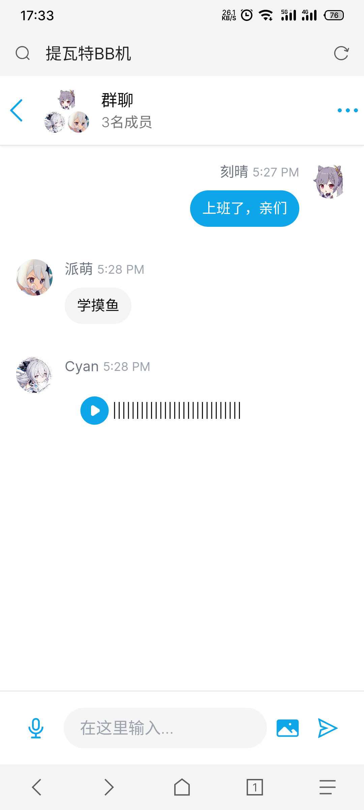

<p align="center">
    
    <div align="center">提瓦特 BB 机</div>
    <p align="center">
    
    
    
    
    </p>
</p>

# 介绍

## 基于 [Next.js](https://nextjs.org) 的全栈项目, 适用于在线即时聊天

- 使用 [typescript](https://www.typescriptlang.org) 作为开发语言
- 使用 [axios](https://axios-http.com) 进行 AJAX 请求
- 使用 [MongoDB Atlas](https://cloud.mongodb.com) 存储用户账号/聊天记录/会话列表
- 使用 [prisma](https://www.prisma.io) 作为 ORM 框架
- 使用 [bcrypt](https://github.com/kelektiv/node.bcrypt.js) 进行密码加密
- 使用 [cloudinary](https://cloudinary.com) 进行图片传输
- 使用 [pusher](https://pusher.com) 进行实时会话推送
- 使用 [tailwindcss](https://tailwindcss.com) 进行网页响应式设计
- 使用 [vercel](https://vercel.com) 部署项目

# 环境配置

`.env文件`

```
DATABASE_URL=MongoDB Atlas数据库地址
NEXTAUTH_SECRET=NEXTAUTH密匙

NEXT_PUBLIC_CLOUDINARY_CLOUD_NAME=cloudinary用户名

NEXT_PUBLIC_PUSHER_APP_KEY=pusher app key
PUSHER_APP_ID = pusher app id
PUSHER_APP_SECRET = pusher app 密匙
PUSHER_APP_CLUSTER = "ap3"

NEXTAUTH_URL = 自定义auth地址"http://localhost:3000/BLL/api/auth"
```

# 运行

- 安装依赖`pnpm i`
- 启动开发环境`pnpm dev`
- 编译上线`pnpm build`
- 启动上线环境`pnpm start`

# 截图

## 电脑端


## 移动端



